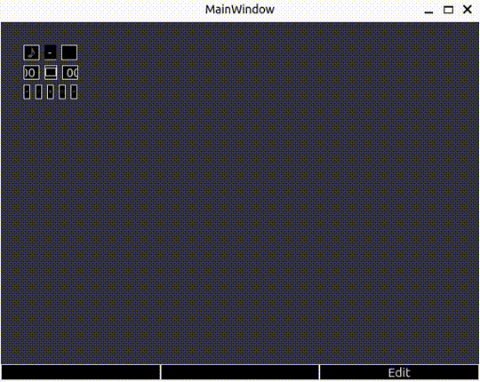

# Deck UI




Simple Cyberdeck User-Interface, Deck UI.  
Written in C++ with Qt Framework, runs in Linux environment. (Ubuntu 22.04)  


## Features

- Able to have multiple screen displays
- Customizable, flexible UI display
- Currently supported display features:
    - Music player
    - Music player file system


## Build

Developed in Qt 6.0.  
Required Qt modules are: Qt Core, Qt Widgets, Qt Multimedia.

Build in Ubuntu(v22.04) Linux.
```bash
sudo apt-get install build-essential libgl1-mesa-dev? qt6-base-dev qt6-multimedia-dev
```

Build command (you can set other directory path for build)
```bash
qmake6 qt_player.pro
make -j8 -C ../build-qt_player
```

Run
```bash
cd ../build-qt_player
./qt_player
```
